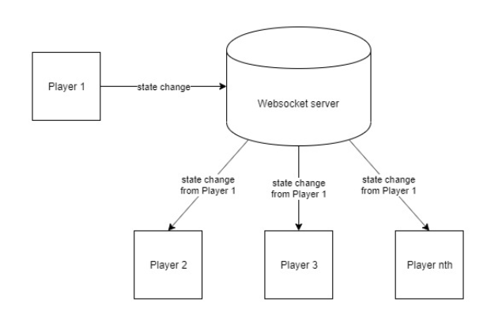
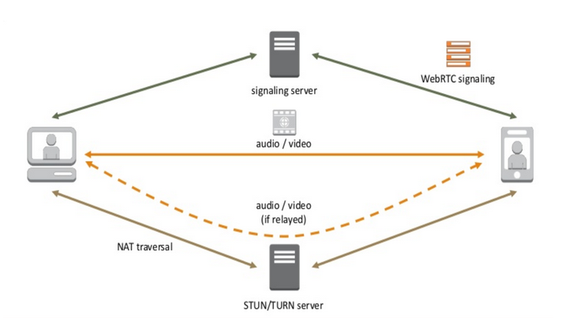

# Virtual Party


*Tired of being along by yourself? Fear of going out but still want to connect? Using camera all the times gives you anxiety?*  
***Virtual Party*** *will help you!*

## How to Run?
### Online Version
Lastest Branch is hosted live at [cspears.site](https://cspears.site/)
### How to Set Up on Your Own Server
index.html: Uncomment code for voice
classes/Socket.js: Uncomment code for Socket.host 

#### Install dependencies
```
cd voice_chat
npm i
```
#### Must have root access
```
pm2 start voice_chat/signaling-server.js 
pm2 start server/secureserver.js
```
### Local Version
1. Navigate to the folder `game/server` in a terminal  

2. Type in `node server.js` to host the server locally  
3. Then install the **Live Server** extention by *Ritwick Dey* in **VSCode**  
4. Once the installation is finished, click **Go Live** on the `index.html`  
5. A new window should popup with the app as a new tab in your preferred browser  
6. You can always visit `localhost:5500` (the defaut port by the extention)  

## Why The Project is Useful?


## What Does The Project do?
### Storyboard


### List of Features


### Architectures
#### Project Architecture
[index.html](index.html)                                            homepage for application

[index.css](index.css)                                              homepage style sheet


[/images/](/images/)                                                contains images used in index.html homepage or in README.md

[/game/](/game/)                                                    contains all files related to the VP game application 

[/game/classes/]([/game/classes/])                                  contains all classes for objects created in the VP game application

[/game/classes/avatar.js](/game/classes/avatar.js)                  class for local avatar model and movement

[/game/classes/billboard.js](/game/classes/billboard.js)            class for billboard displayed above player head

[/game/classes/input.js](/game/classes/input.js)                    class for reading player input

[/game/classes/player.js](/game/classes/player.js)                  class for online player models and movement

[/game/classes/socket.js](/game/classes/socket.js)                  class for creating socket on client environment

[/game/classes/UI.js](/game/classes/UI.js)                          class for inititializing events and sockets

[/game/classes/world.js](/game/classes/world.js)                    class for creating the virtual environment

[/game/classes/CSS3DObject.js](/game/CSS/CSS3DObject.js)            class for live video stream rendering

[/game/classes/CSS3DRenderer.js](/game/CSS/CSS3DRenderer.js)            class for live video stream rendering

[/game/assets/ ](/game/assets/)                                     contains all models, player skins, videos, images used inside the VP app

[/game/server/server.js](/game/server/server.js)                    socket server for hosting mulitplayer on local host or over http non-secure connection

[/game/server/secureserver.js](/game/server/secureserver.js)        socket server for hosting multiplayer over secure HTTPS connection


#### Multiplayer Architecture 


We enabled multiplayer by running a websocket server. Each player creates a socket node. We update local state changes 
from `/game/classes/avatar.js` and send this information over the socket connection in `/game/classes/socket.js`. 
So if you move your avatar, this information will be sent to the socket server. The socket server then sends the state
change to all other connected sockets / players. The other players then update their state locally.

#### Voice Chat Architecture


We enabled voice chat using a **WebRTC P2P** connection. Clients first connect to a Google **STUN** server to find
their public IP. We are hosting a signaling server that establishes a network channel between users so they
can create a peer to peer connection with each other in `/game/voice_chat/singaling-server.js`. Players can then 
send their voice directly to each other using this connection. This architecture enables real-time voice 
communication between users.

## Contributors


### Helps
