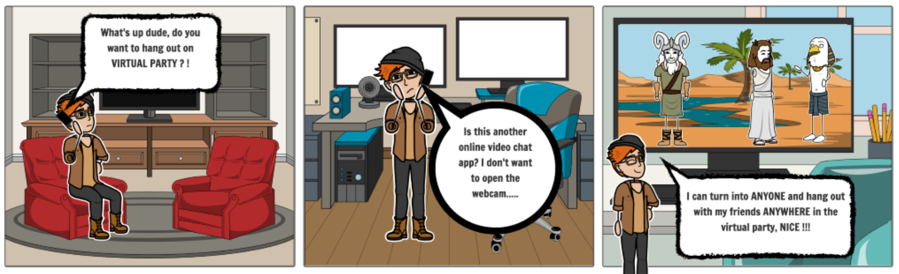

# Virtual Party


> *Tired of being along by yourself? Fear of going out but still want to connect? Using camera all the times gives you anxiety?*  

**Virtual Party** will help you!

## Index
- [How to Run](#how-to-run)
- [Why The Project is Useful?](#why-the-project-is-useful)
- [What Does The Project do?](#what-does-the-project-do)
- [Contributors](#contributors)
- [Resources](#resources)

## How to Run?
### Online Version
Lastest Branch is hosted live at [cspears.site](https://cspears.site/)
### How to Set Up on Your Own Server
After cloning this repository, you need to make changes on two files:
- `index.html`: Uncomment code for voice
- `classes/Socket.js`: Uncomment code for Socket.host 

Then, proceed with following steps.

#### Install dependencies
```
cd voice_chat
npm i
```
#### Must have root access
```
pm2 start voice_chat/signaling-server.js 
pm2 start server/secureserver.js
```
### Local Version
1. Navigate to the folder `game/server` in a terminal  

2. Type in `node server.js` to host the server locally  
3. Then install the **Live Server** extention by *Ritwick Dey* in **VSCode**  
4. Once the installation is finished, click **Go Live** on the `index.html`  
5. A new window should popup with the app as a new tab in your preferred browser  
6. You can always visit `localhost:5500` (the default port by the extension)  

## Why The Project is Useful?
Since the begining of the lockdown due to COVID-19, the majority of people started to moving away from face-to-face interactions to virtual communication.

However, there is need for social app that offers a laid back and immersive experience. Looking at the current social/real-time communication apps have their downsides:
- **Zoom:** offers a very formal setting, has no open lobbies, and almost no interactions/entertainment offered
- **Gather.Town:** lacks of immersive 3D experience and open lobbies
- **Mozilla Hubs:** scenes are less realistic, online video streaming works doesn't work as anticipated

Many current real-time communication apps rely on open-camera to improve the overall immersive experience that the user could have. However, facing a open-camera could add a level of stress to certain users which will lead them to give up the opportunity to socilize. Besides, many similar services in the market cannot run on mobile platform without installing a dedicated phone app.

## What Does The Project do?

### Storyboard
We realized that most users who value virtual communications care about two main features the most:
- Immersive communication
- Laid-back experience

Before our team consolidated the project direction, we used the following two storyboards to help us navigate through the entire process of project design.


This storyboard outlines a concern that certain users share: they are afriad of using the communication apps on the market because their interaction requires them to keep the camera open to facilitate. This requirement makes some of the users feel uncomfortable. To resolve such issue, we planned to create an app that could offer, at least, an interactive experience that is on par with the current solutions. We came to the decision that we would build a realistic VR environment added with interactive activities.  

</br>
</br>


This storyboard showcases the common need that most users share: to feel being "there." Besides, most users want to have a laid-back experience. In order to resolve the needs, we decided to implement the application with real-time voice chat and open lobby that everyone could join. We also decided to implement online/offline video watching functionality to provide interactions.

### List of Features


### Architectures
In this section, we are going to introduce the architectures of our application from 4 perspectives:
- [Project Architecture](#project-architecture)
- [Multiplayer Architecture](#multiplayer-architecture)
- [Voice Chat Architecture](#voice-chat-architecture)
- [Live Video Architecture](#live-video-architecture)

#### Project Architecture
In the root, we have:
- [index.html](index.html)                                            homepage for application
- [index.css](index.css)                                              homepage style sheet  

The two main folders:
- [/images/](/images/)                                                contains images used in `index.html` homepage or in `README.md`
- [/game/](/game/)                                                    contains all files related to the VP game application

The `/game/` folder is what the game made up of:
1. [/game/classes/]([/game/classes/]) contains all classes for objects created in the Virtual Party game application
    * [/game/classes/avatar.js](/game/classes/avatar.js)                  class for local avatar model and movement
    * [/game/classes/billboard.js](/game/classes/billboard.js)            class for billboard displayed above player head
    * [/game/classes/input.js](/game/classes/input.js)                    class for reading player input
    * [/game/classes/player.js](/game/classes/player.js)                  class for online player models and movement
    * [/game/classes/socket.js](/game/classes/socket.js)                  class for creating socket on client environment
    * [/game/classes/UI.js](/game/classes/UI.js)                          class for inititializing events and sockets
    * [/game/classes/world.js](/game/classes/world.js)                    class for creating the virtual environment
    * [/game/classes/CSS3DObject.js](/game/CSS/CSS3DObject.js)            class for live video stream rendering (Provided by *ozRocker* at [here](https://forum.babylonjs.com/t/youtube-videos-on-a-mesh-port-of-css3drenderer-js/10600))
    * [/game/classes/CSS3DRenderer.js](/game/CSS/CSS3DRenderer.js)            class for live video stream rendering(Provided by *ozRocker* at [here](https://forum.babylonjs.com/t/youtube-videos-on-a-mesh-port-of-css3drenderer-js/10600))

2. [/game/assets/ ](/game/assets/)                                     contains all models, player skins, videos, images used inside the Virtual Party app
    - [/game/server/server.js](/game/server/server.js)                    socket server for hosting mulitplayer on local host or over HTTP non-secure connection
    - [/game/server/secureserver.js](/game/server/secureserver.js)        socket server for hosting multiplayer over secure HTTPS connection


#### Multiplayer Architecture 


We enabled multiplayer by running a websocket server. Each player creates a socket node. We update local state changes 
from `/game/classes/avatar.js` and send this information over the socket connection in `/game/classes/socket.js`. 
So if you move your avatar, this information will be sent to the socket server. The socket server then sends the state
change to all other connected sockets / players. The other players then update their state locally.

#### Voice Chat Architecture


We enabled voice chat using a **WebRTC P2P** connection. Clients first connect to a Google **STUN** server to find
their public IP. We are hosting a signaling server that establishes a network channel between users so they
can create a peer to peer connection with each other in `/game/voice_chat/singaling-server.js`. Players can then 
send their voice directly to each other using this connection. This architecture enables real-time voice 
communication between users.

#### Live Video Architecture 


We enabled a live interactive stream of a YouTube video with `CSS3DRenderer.js` and `CSS3DObject.js`. We first create an
**iFrame** that holds the YouTube video and inject it into the `game.html` code. We then append this iFrame into the virtual 
environment and render it inside the virtual world created in the `world.js` file. 


## Contributors
Virtual Party was created at UC San Diego by Team Virtual Party. Our team consists of:
- **Curtis Spears** (Backend & Networking): BS CS Student at UC San Diego
- **Caiting Wu** (Gameplay Programmer): MS CS Student at UC San Diego
- **Haotian Qiu** (Gameplay Programmer): MS CS Student at UC San Diego
- **Haozhe Luo** (Graphics): MS CS Student at UC San Diego

### Helps
If you have any questions regarding Virtual Party, please email any one of our team members.
- Curtis Spears: cspears@ucsd.edu
- Caiting Wu: c1wu@eng.ucsd.edu
- Haotian Qiu: h1qiu@ucsd.edu
- Haozhe Luo: h2luo@ucsd.edu   

## Resources
- [Forum threads on streaming YouTube Videos in BabylonJS](https://forum.babylonjs.com/t/youtube-videos-on-a-mesh-port-of-css3drenderer-js/10600)
- [Forum threads on possibility of avoid VR crashing under online video streaming enabled](https://forum.babylonjs.com/t/youtube-playback-using-css3drenderer-js-breaks-upon-entering-vr/16521)
- [Playground example on imported GLTF file textures](https://playground.babylonjs.com/#0ABNPK#13)
- [Playground example on shadow casting](https://www.babylonjs-playground.com/#1XVEKZ#25)
